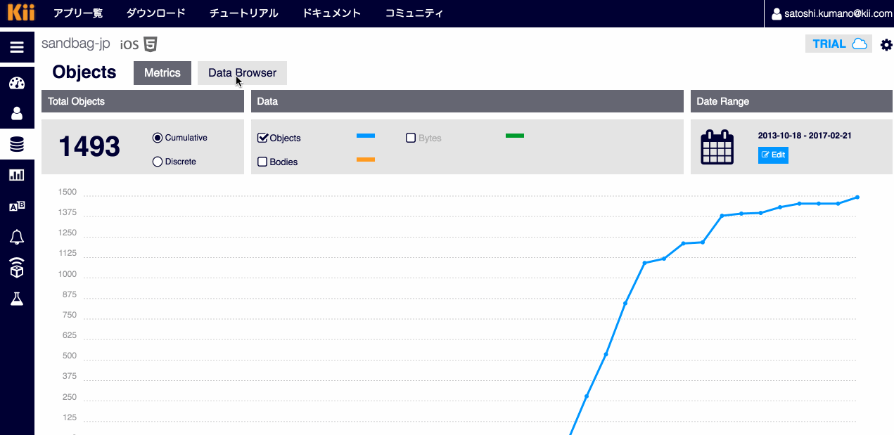

# kii-armadillo-serial-sample

Armadillo-IoTゲートウェイ上で動作するサンプルアプリケーションです。
シリアルから入力された文字列をKii Cloudにアップロードします。

(このサンプルコードはArmadillo-IoTゲートウェイの開発者サイトで公開されている、C言語による実践プログラミング [シリアルポートの入出力](http://manual.atmark-techno.com/armadillo-guide/armadillo-guide-2_ja-2.1.0/ch06.html#sec_using_serial_port)をベースにしています。)

## 1. 要件
- Armadillo-IoTゲートウェイ<br>
このサンプルアプリケーションの動作確認には「Armadillo-IoTゲートウェイ G2」を使用しました。

- RS232Cアドオンモジュール<br>
(「Armadillo-IoTゲートウェイ G2」を利用する場合には標準で搭載されています。)

- ATDE<br>
このサンプルアプリケーションの動作確認にはATDE5を使用しました。

- Windowsマシン(仮想マシンでも可)<br>
このサンプルアプリケーションの動作確認にはWindows10を使用しました。

- シリアルクロスケーブル<br>
このサンプルアプリケーションの動作確認には以下のケーブルとD-sub9ピンをメスに変換するアダプタを利用しました。<br><br>
iBUFFALO USBシリアルケーブル(USBtypeA to D-sub9ピン)0.5m ブラックスケルトン BSUSRC0605BSk

## 2. 準備

### 2.1 Tera Termのインストール
WindowsマシンにTera Termをインストールします。

### 2.2 Armadillo-IoT の起動

デバッグシリアルケーブルとWindowsマシンを接続します。<br>
[4.4章](http://manual.atmark-techno.com/armadillo-iot/armadillo-iotg-std_product_manual_ja-2.8.0/ch04.html#sct.connect-method)を参照。


Tera Termからデバッグシリアルポートに接続しArmadilo-IoTをbootします。<br>

[5章](http://manual.atmark-techno.com/armadillo-iot/armadillo-iotg-std_product_manual_ja-2.8.0/ch05.html)
を参考にしてください。


Tera Termのシリアル接続設定は[こちら](http://manual.atmark-techno.com/armadillo-iot/armadillo-iotg-std_product_manual_ja-2.8.0/ch04.html#table.setup-minicom-on-atde.settings)と同じになるようにします。

Armadillo-IoTが起動したらrootでログインしておきます。

#### 2.2.1. IPアドレスの確認 (Tera Term上での操作)

ifconfig を実行しArmadillo-IoTに割り当てられたIPアドレスを確認しておきます。
```shell
$ ifconfig
```

### 2.3 ATDE のインストールとクロスコンパイル

[第４章](http://manual.atmark-techno.com/armadillo-iot/armadillo-iotg-std_product_manual_ja-2.8.0/ch04.html)
を参考にしてATDEをインストールしてください。

(このチュートリアルではATDEからminicomを利用してArmadillo-IoTへの接続は必須ではありません。)

#### 2.3.1. ソースコードの取得 (ATDE上での操作)

atmark ユーザーでログインしてホームディレクトリに作業用ディレクトリを作成します。


```shell
$ mkdir work
$ cd work
```

Githubからソースコードを取得します

```shell
$ git clone https://github.com/satoshikumano/kii-armadillo-serial-sample.git
```

#### 2.3.2. Kii Cloudのアプリケーションの設定

[Kii Developer console](https://developer.kii.com/v2/apps) に移動してアプリケーションを作成します。<br>
アプリケーション名・サーバーロケーション・プラットフォームは任意の値を選択可能ですが<br>

このチュートリアルではサーバーロケーション：Japanを選択します。<br>

作成が完了したらアプリケーションのIDとKeyを確認しておきます。<br>

[IDとKeyの確認](http://docs.kii.com/ja/guides/devportal/application_console/#アプリの設定)

#### 2.3.3. Thingの作成 (Developer Console上での操作)

Developer consoleでThingを作成しておきます。


#### 2.3.4. アプリケーションの設定変更 (ATDE上での操作)

```shell
$ cd kii-armadillo-serial-sample
$ vi kii/kii_upload.h
```

kii_upload.hを編集します。
EX_AUTH_VENDOR_ID、EX_AUTH_VENDOR_IDの値を [Thingの作成](#Thingの作成) で設定したvendor thing id/ passwordに置き換えます。<br>

EX_APP_ID、EX_APP_KEYに作成したKii CloudアプリケーションのID、Keyをそれぞれ設定します。
(アプリケーションの作成時にJapan以外のサーバーロケーションを選択した場合はEX_APP_SITEの文字列の変更が必要です。)

#### 2.3.5. Armadilo-IoTのIPアドレス設定 (ATDE上での操作)

```shell
$ vi Makefile
```

`TARGET_IP` の値を`ifconfig` で調べたIPアドレスに置き換えます。

#### 2.3.6. ビルドと転送 (ATDE上での操作)
make を実行することでArmadillo IoT向けのアプリケーションのビルドと転送が開始されます。

```shell
$ make 
```

## 3. 実行

### 3.1. アドオンモジュールとWindows PCの接続

アドオンモジュールとWindows PCをシリアルクロスケーブルで接続します。

Tera Termで新しいシリアル接続を開始します。

設定項目|値
--- | ---
転送レート|9600bps
データ長|8bit
ストップビット|1bit
パリティ	|なし
フロー制御|なし


### 3.2. 転送したアプリケーションの実行 (Tera Term上での操作)

デバッグシリアルで接続したTera Term上で以下を実行します。

```sh
$ cd /home/ftp/pub
$ chmod a+x serial-sample
$ export LD_LIBRARY_PATH=./kii
$ ./serial-sample /dev/ttymxc3
```

serial-sampleの実行時の引数 `/dev/ttymxc3` はRS232Cアドオンモジュールに対応するttyデバイスファイルになります。
ttyデバイスファイル名の詳細については[こちら](http://armadillo.atmark-techno.com/howto/iotg-use-rs00)を参照ください。

実行すると以下のメッセージがアドオンモジュールと接続したTera Termに表示されます。
```
Input message bracketed with {}
```

アドオンモジュールと接続したTera Termで{Hello!}と入力します。
以下のメッセージがアプリケーションから送信され、再び入力待ち状態に遷移します。

```
Message: Hello!
Uploading...
Upload done!
Input message bracketed with {}
```

### 3.3. アップロードされたデータの確認

Developer consoleからデータブラウザにアクセスして
アップロードされたデータを確認します。

Thing Scope を選択して、
[2.3.3. Thingの作成](#233-thingの作成-developer-console上での操作)で指定したvendor thing idを入力します。データがアップロードされていれば`my_bucket`という名前のバケットが作成されますので、バケットを選択しオブジェクトを閲覧します。



